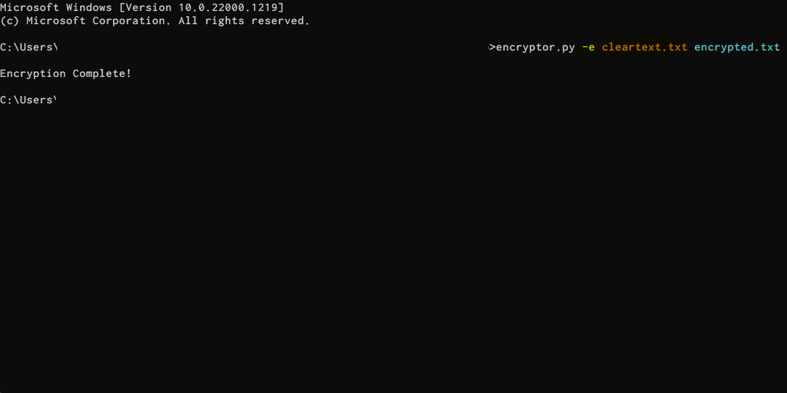
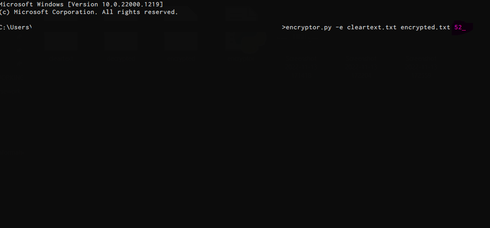
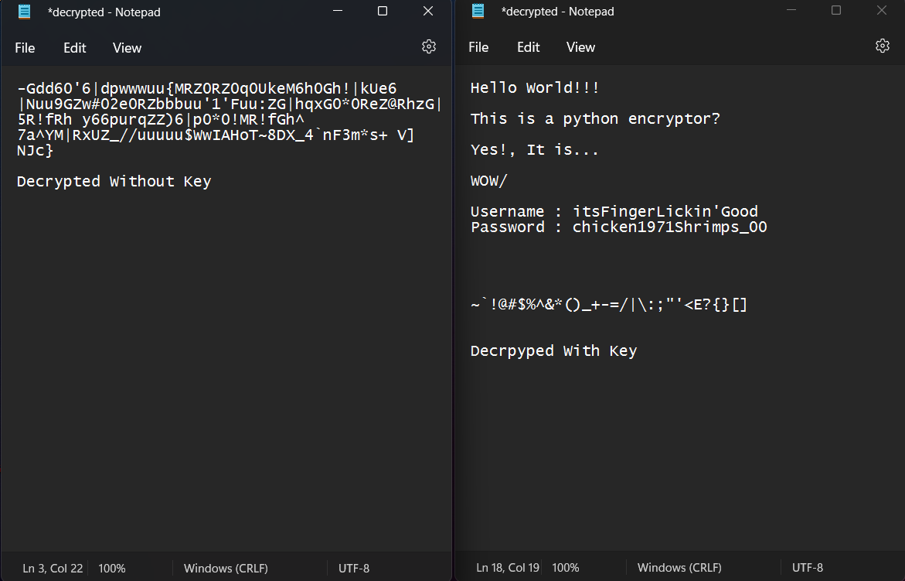

# Encryptor

Encrypt any cleartext files using Python

---
---

## Usage

---

### Encryption

> `-e` flag can be used to encrypt any program, followed by the Text(`txt`) file
> to be encrypted and, a name plus extension for the output file.

Example : `encrypt.py -e ClearText.txt Output.txt`

> A __Key__ Value can be passed in to the program as a console argument.
> This key is required to decrypt the created encrypted text file. This way,
> an extra layer of protection can be added.

---

### Decryption

> Just like in Encryption, `-d` flag can be passed as the first console argument.
> Followed by the encrypted text file and then an output file name plus the extension.

Example : `encrypt.py -d Output.txt Decoded.txt`

> A key can be passed in as the final console argument, if a was used in the encryption
> Process. In a case of a wrong key or if the file was decrypted without the Key.
> The decoded file will show a corrupted output.

Example : `encrypt.py -d Output.txt Decoded.txt 1234`

---
---

#### __This program was made purely for education purposes and fun__

#### __It is not recommended to be use for actual secure communication!__

---
---
