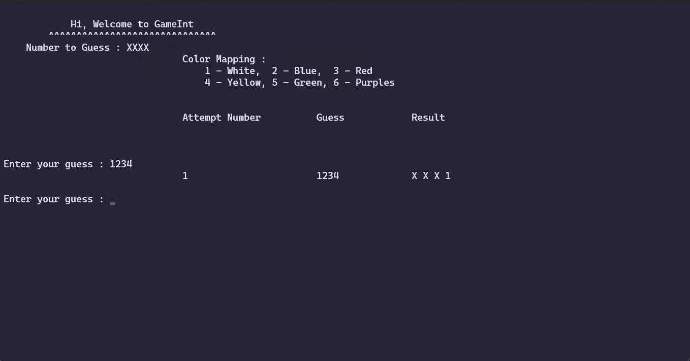
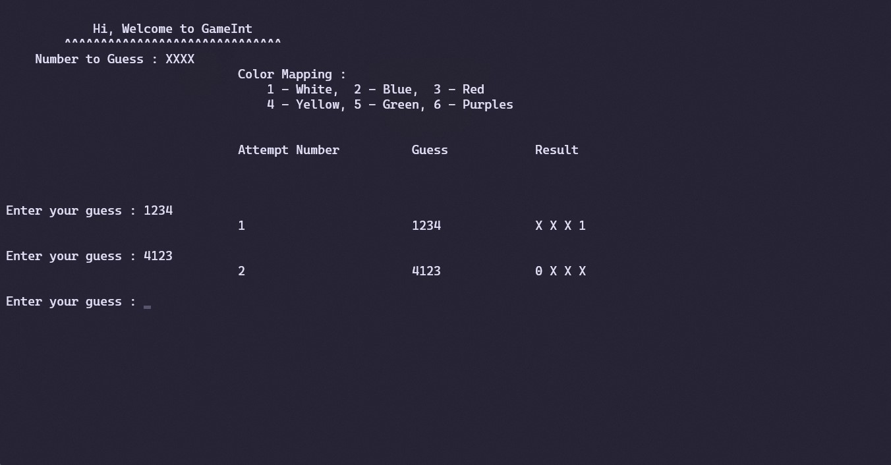
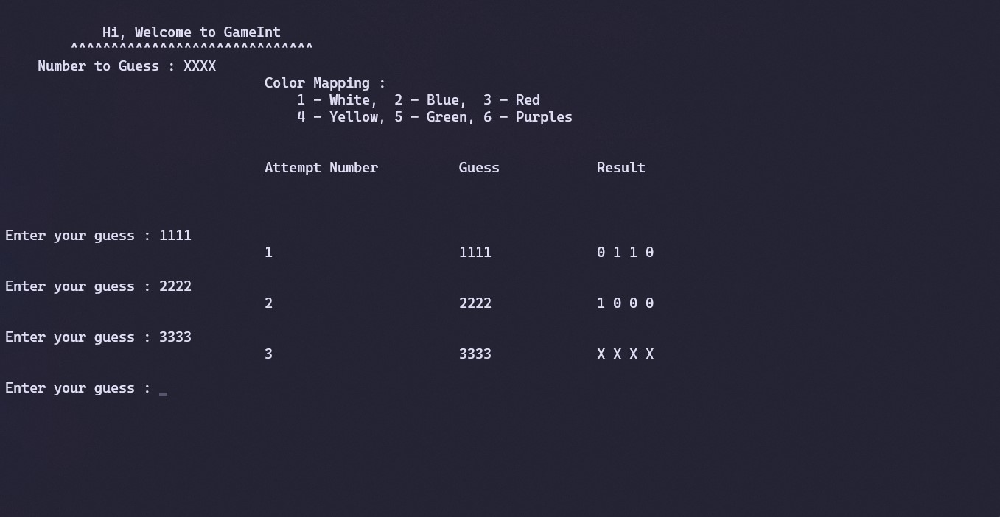

# GuessInt Game

A small terminal based game made in python, where the objective is to guess a secret number generated by the program.

## How to Play

Program will generate a __4 digit secret number__, where all digits of number will be within
__1 and 6__ (1, 6 included).

User must guess this number __within 8 tries__.

When the user gets a digit of the secret number correct,
the program would output a __1__ in it's position.

 *Example :*

 Secret Number : 1234

 Guess :         5535

 Output:         XX1X

If the user guesses a digit which is in the number, but not in correct position,
the program would output a __0__ in it's position.

 *Example :*

 Secret Number : 1234

 Guess :         5553

 Output:         XXX0

If user guesses neither, program outputs __XXXX__.

