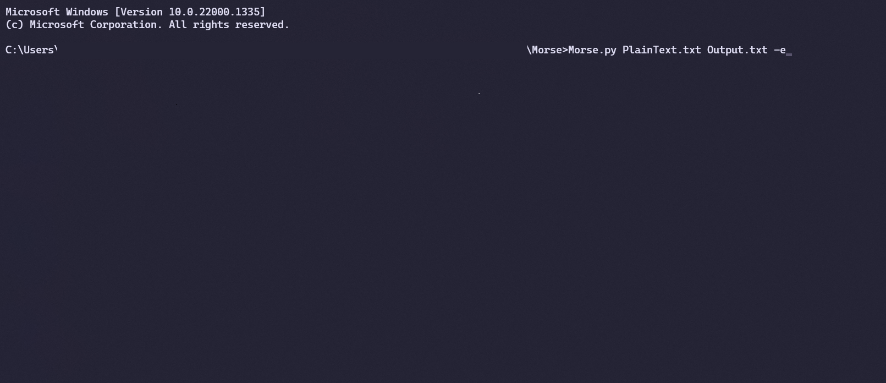
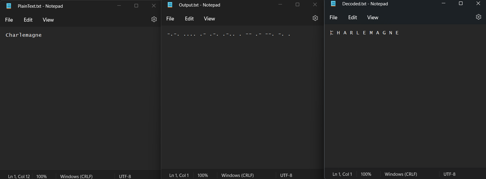

# Morse Code Encoder/Decoder

Can be used to encode Plain Text to Morse Code and vice versa.

## Requirements

1. A text file with text content needed to be encoded into Morse Code needs to be,
    pointed to, within the console arguments. The file needs to in the same
    directory as the program

2. A text file will be generated on output within the same folder.
    A unique name must be given to generate this file to avoid overwriting
    existing files

3. Third console argument is a flag, either `-e` for encoding, or `-d` for decoding can be used.

4. Program can be run on any terminal application of a system where Python is accessible from the
    terminal.

 *Example console argument :* `Morse.py Plaintext.txt Output.txt -e`

