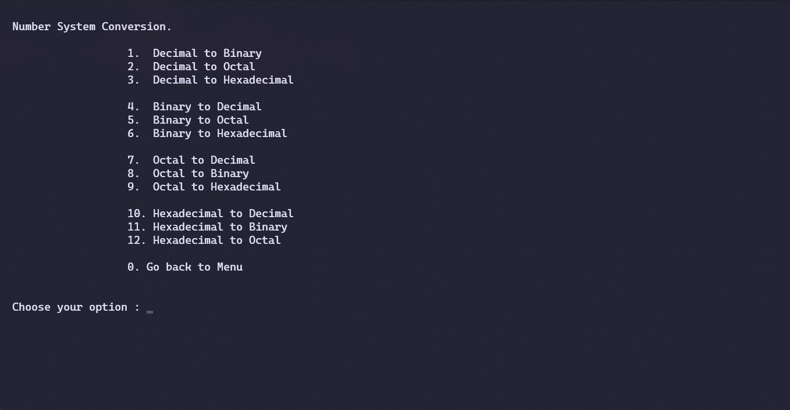
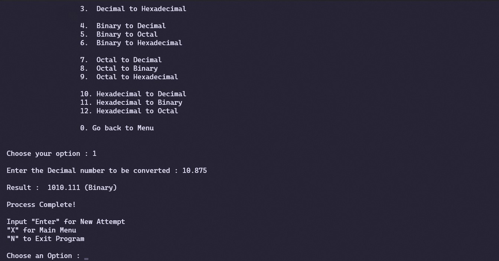

# Number System Converter

Converts numbers between bases (Binary, Octal, Decimal, Hexadecimal)

---
---

## Features

> 1. Can convert any number of any base into another base directly
> 2. Can convert Decimal numbers.
> 3. TUI Menu.

---
---
