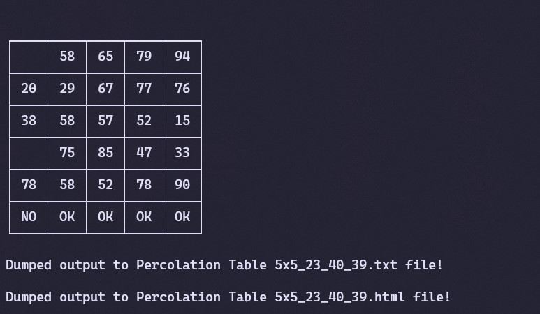
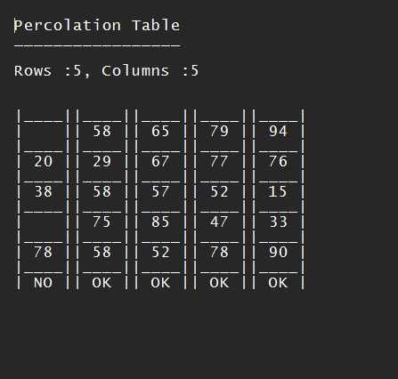
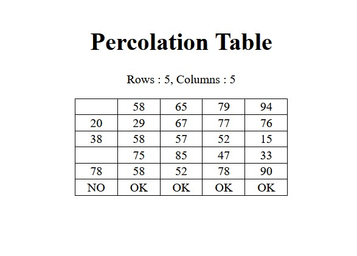

# Percolation Simulation Table Generator

Percolation is the process of liquid passing through a filter.
This program generates a grid which can simulate this process.

---
---

## How does it work?

> Program generates a grid filled with random numbers and spaces.
> If a column has a empty space within it, it's considered that
> percolation is not possible within that column.
>
> If percolation isn't possible within a specific column, it is checked for and marked
> within the last row of the grid. A `OK` output where percolation is possible and a
> `NO` output where it isn't.

Example:

---

## Features

> User can insert how many rows/columns the grid may have to get the grid they want.
> This can be done by running the program within a terminal application and inserting,
> the row/column values as console arguments.
> *Example Argument:*
> `perc.py 3x4` where `3` is the number of rows and `4` is the number of columns.
>
> Program can be run without console arguments to generate a `5x5` grid.
> Program can write the output to a Text file as well as an HTML file both.

---

## Limitations

> The program can only create grids where the minimum number of rows/columns is 3,
> while the maximum number is 9.

---

## Requirements

> Program requires `PrettyTable` module to be available within the users system,
> else, it will have limited functionality.
> You can download this module by using `pip`
> Run:
> `pip install prettytable` within the terminal of your choice.
>
> Python must be added to the system's PATH for both the module and the program to work.
>
> Program must be run with `perc.py`, `main.py` must be present at the same directory as `perc.py.`

---
---
